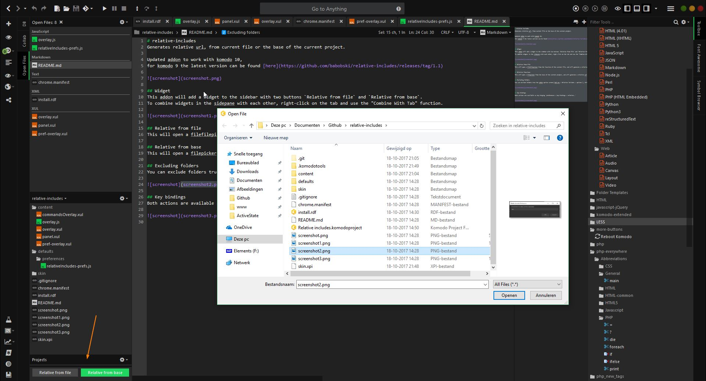
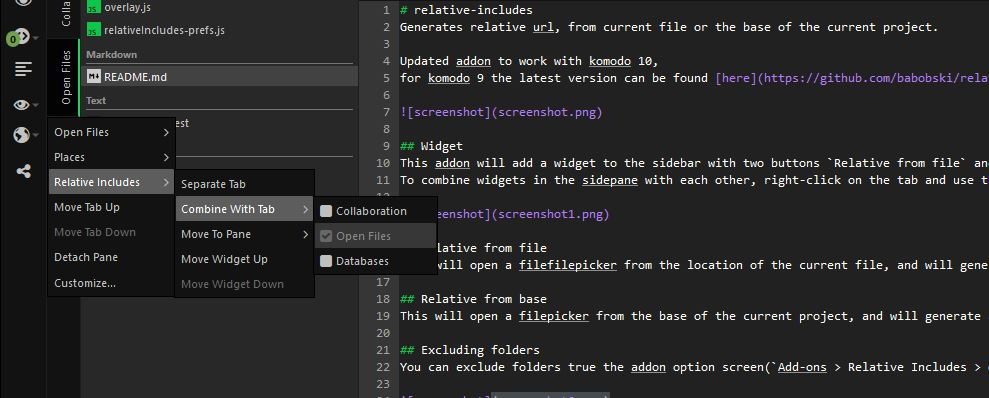
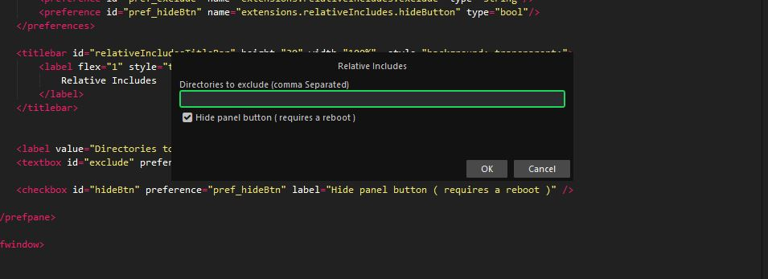
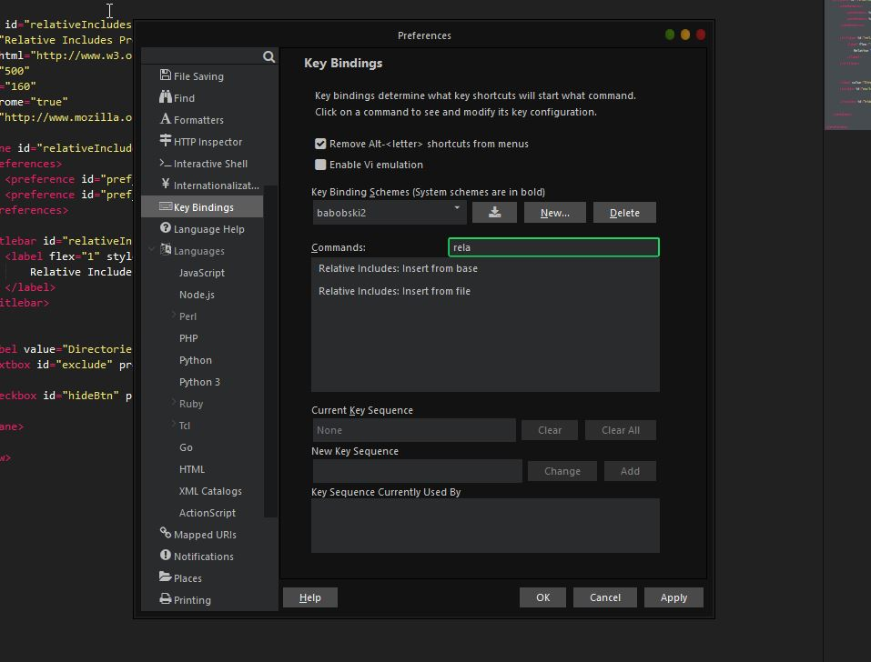

# relative-includes
Generates relative url, from current file or the base of the current project.

Updated addon to work with komodo 11,  
for komodo 9 the latest version can be found [here](https://github.com/babobski/relative-includes/releases/tag/1.1)

## Widget
This addon will add a widget to the sidebar with two buttons `Relative from file` and `Relative from base`.  
To combine widgets in the side pane with each other, right-click on the tab and use the "Combine With Tab" function.

## Relative from file
This will open a filepicker from the location of the current file, and will generate a relative url from the location of the current file.

## Relative from base
This will open a filepicker from the base of the current project, and will generate a relative url from the base of the current project.

## Excluding folders
You can exclude folders true the addon option screen(`Add-ons > Relative Includes > options`), this can be useful when you compiling less/scss and when you have your files not at the same level as the compiled result.

## Hiding panel button
In the preferences menu you can choose to disable the panel button ( if you don't need it ),

## Key bindings
Both actions are available as key binging `preferences > key bindings > relative..`

