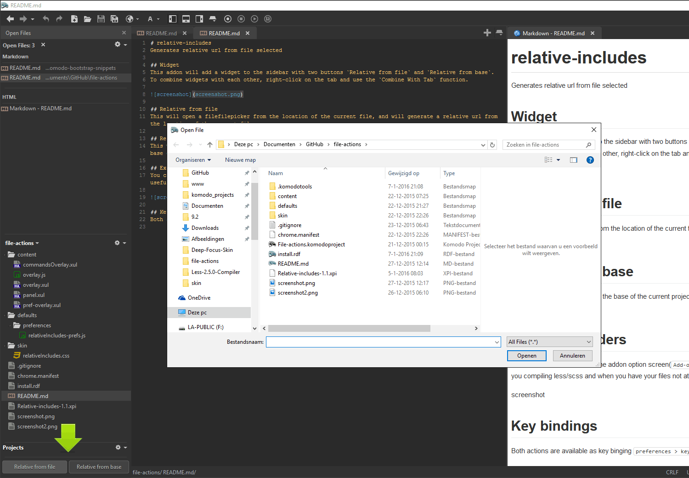
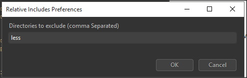

# relative-includes
Generates relative url from file selected

## Widget
This addon will add a widget to the sidebar with two buttons `Relative from file` and `Relative from base`.  
To combine widgets with each other, right-click on the tab and use the `Combine With Tab` function.

## Relative from file
This will open a filefilepicker from the location of the current file, and will generate a relative url from the location of the current file.

## Relative from base
This will open a filepicker from the base of the current project, and will generate a relative url from the base of the current project.

## Excluding folders
You can exclude folders true the addon option screen(`Add-ons > Relative Includes > options`), this can be useful when you compiling less/scss and when you have your files not at the same level as the compiled result.

## Key bindings
Both actions are available as key binging `preferences > key bindings > relative..`
